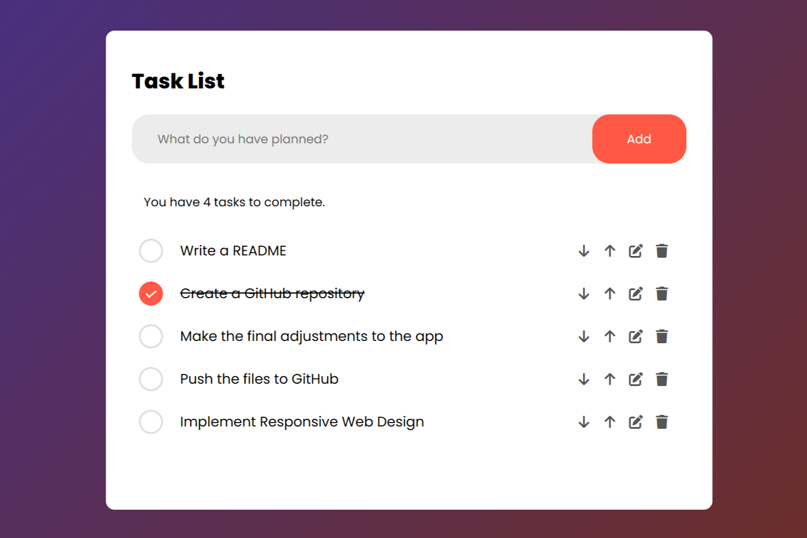
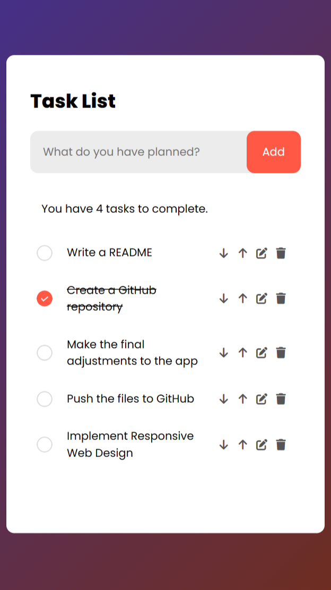

# Task List Web App
## Simplify Your Task Management: Add, Edit, Reorder, Delete

### *Overview*:
The Task List Web App is a user-friendly task management application developed using JavaScript, HTML, and CSS. It enables users to efficiently add, edit, and organize tasks. Task data is stored locally, ensuring tasks are retained even after closing the application. Moreover, the application is optimized for smaller screens, delivering a seamless user experience across various devices.



### *Features*:
- Add new tasks.
- Display the count of tasks to be completed.
- Mark tasks as completed.
- Reorder tasks using arrow icons.
- Edit existing tasks.
- Delete tasks.
- Utilized local storage for persistent data.
- Implemented Responsive Web Design for various screen sizes.

### *Prerequisites*:
You'll need a web browser to run the application. Additionally, you will need an active Font Awesome Kit to deliver the icons used in the project. Copy your Kit's unique embed code into your HTML head tag.

### *Installing*:
1. Clone the repository to your local machine.
   ```bash
   git clone https://github.com/annadada/task-list-app.git
    ```
2. Open the project folder in your preferred code editor.
3. Open the index.html file in your web browser.

### *Usage*:
- Enter your task in the input box and click the "Add" button to add it to your to-do list.
- Click the arrow icons to move a task up or down in the list.
- Click the pencil icon to edit a task. Click the floppy disk icon to save your changes.
- Click the trash can icon to delete a task.
- Click the empty circle icon next to a task to mark it as completed.

<p align="center">
  
</p>

### *Acknowledgments*:
This project was inspired by various to-do list apps and tutorials. A significant source of inspiration and the most substantial contribution to this project came from the [GreatStack YouTube tutorial](https://www.youtube.com/watch?v=G0jO8kUrg-I&ab_channel=GreatStack).
